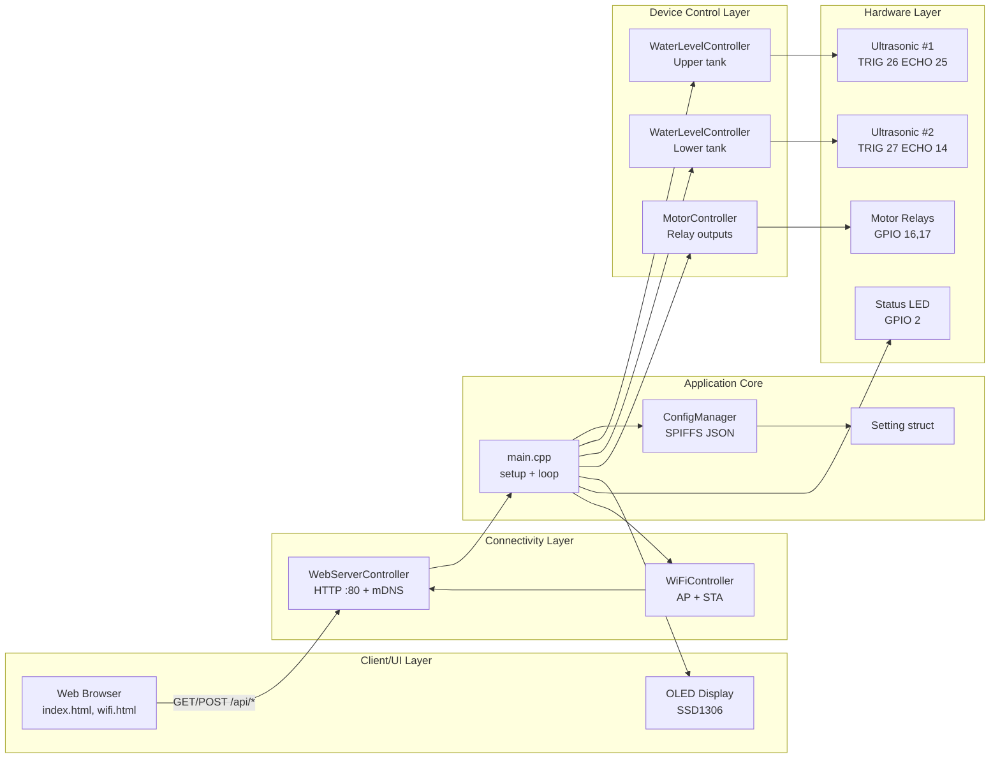

# MotorStarter Architecture

## 1. Purpose and Scope
MotorStarter is an ESP32-based IoT controller for monitoring tank water levels and controlling two motor outputs. It provides:
- Local control loop using ultrasonic sensors and relays
- Local web dashboard and settings API over WiFi
- OLED display output for live status
- JSON-based persistent settings in SPIFFS

The current implementation is a monolithic Arduino application centered in `src/main.cpp` with controller classes included directly as `.cpp` files.

## 2. Platform and Runtime
- Board: ESP32 DevKit (`esp32dev`)
- Framework: Arduino
- Build system: PlatformIO
- Key libraries:
  - ESPAsyncWebServer
  - ArduinoJson
  - ThingPulse SSD1306 OLED driver

See `platformio.ini` for exact versions.

## 3. Logical Architecture

## 4. Main Components

### 4.1 `main.cpp`
- Declares compile-time feature flags (`WIFI_ENABLED`, `WEB_SERVER_ENABLED`, etc.).
- Owns global singletons for all controllers.
- Wires routes and handlers for the web API.
- Executes the continuous control loop:
  1. Update WiFi status LED
  2. Read upper and lower water levels
  3. Render status on OLED
  4. Apply motor outputs

### 4.2 `WiFiController`
- Starts ESP32 in `WIFI_AP_STA` mode.
- Brings up an access point and tries to connect to configured station SSID/password.
- Exposes connectivity checks and RSSI access.

### 4.3 `WebServerController`
- Hosts static content from SPIFFS (`/`, `/index`, `/wifi`, and static assets).
- Adds permissive CORS headers.
- Provides helper handlers for settings and network info.
- Enables mDNS host discovery (`cbk.local`).

### 4.4 `ConfigManager`
- Mounts SPIFFS.
- Reads and writes `/appSetting.json` into/from `Setting` struct.
- Persists WiFi credentials, trigger thresholds, automation flags, and refresh interval.

### 4.5 `WaterLevelController`
- Uses ultrasonic trigger/echo cycle to measure distance.
- Converts distance to percentage based on configured geometry.
- Produces `WaterLevel` values (`Distance`, `LevelPercent`, `OutputEnabled`).

### 4.6 `MotorController`
- Writes two relay GPIO outputs based on `WaterLevel.OutputEnabled` from upper/lower controllers.

### 4.7 `DisplayController`
- Renders time and two progress bars on SSD1306 OLED over I2C.

## 5. Startup Sequence

1. Configure board pins (LED, buzzer).
2. Start serial logging.
3. Initialize display.
4. Initialize SPIFFS and load settings from `/appSetting.json`.
5. Initialize WiFi (AP + STA).
6. Register HTTP API and page routes; start web server.
7. Initialize water-level controllers and motor controller.
8. Enter infinite `loop()`.

## 6. Runtime Control Flow

### 6.1 Device-side closed loop
- `WaterLevelController.checkLevel()` reads each ultrasonic sensor.
- `DisplayController.showProgress()` updates local status display.
- `MotorController.controlMotor()` applies relay outputs.

### 6.2 Browser interaction loop
- Browser JS calls:
  - `GET /api/dashboard-data` for live telemetry
  - `GET /api/setting` and `POST /api/setting` for configuration
  - `GET /api/wifi-setting` and `POST /api/wifi-setting` for WiFi credentials
  - `POST /api/restart` to reboot the ESP32
- Settings writes are persisted through `ConfigManager.saveConfig()`.

## 7. API Surface

### JSON APIs
- `GET /api/dashboard-data`
- `GET /api/setting`
- `POST /api/setting`
- `GET /api/wifi-setting`
- `POST /api/wifi-setting`
- `POST /api/restart`

### Pages / Static
- `/`, `/index` -> dashboard
- `/wifi` -> WiFi settings page
- `/home`, `/network-ino`, `/timer` -> additional pages/handlers

## 8. Configuration Model
`Setting` fields include:
- Network: AP name/password/IP, station SSID/password
- Tank calibration and trigger thresholds for upper/lower tanks
- Motor run-hour counters
- Auto-control flags (motor/light/UPS)
- UI refresh interval (`PageRefreshSeconds`)

Default persisted file: `data/appSetting.json` (uploaded to SPIFFS partition).

## 9. Optional/Disabled Modules
The repository also contains optional controllers currently disabled by compile-time flags or comments:
- Bluetooth (`BluetoothController.cpp`)
- Blynk cloud integration (`BlynkController.cpp`)
- RTC (`RtcController.cpp`)
- Current sensor (`CurrentSensor.cpp`)
- ESP-NOW (`EspNowController.cpp`)

## 10. Architectural Observations

### Strengths
- Clear controller split by concern (WiFi, web, config, sensors, motor, display).
- Straightforward deployment and operation on a single ESP32.
- Simple browser-based management interface.

### Current limitations
- Blocking delays in control path (`delay(100)` in both water level and motor paths) reduce responsiveness.
- Sensor reads rely on blocking `pulseIn`, which can stall loop under fault conditions.
- API authentication is minimal/inconsistent; CORS is fully open.
- Global mutable state shared by loop and request handlers.
- `.cpp`-inclusion style in `main.cpp` tightly couples translation units.

## 11. Future Evolution (Suggested)
- Move from blocking loop to non-blocking scheduler/state machine (`millis()` driven).
- Add sensor timeout/fault handling and hysteresis for motor switching.
- Harden API security (auth + scoped CORS).
- Refactor controllers to proper headers/compilation units.
- Add unit/integration tests for config parsing and control logic.
